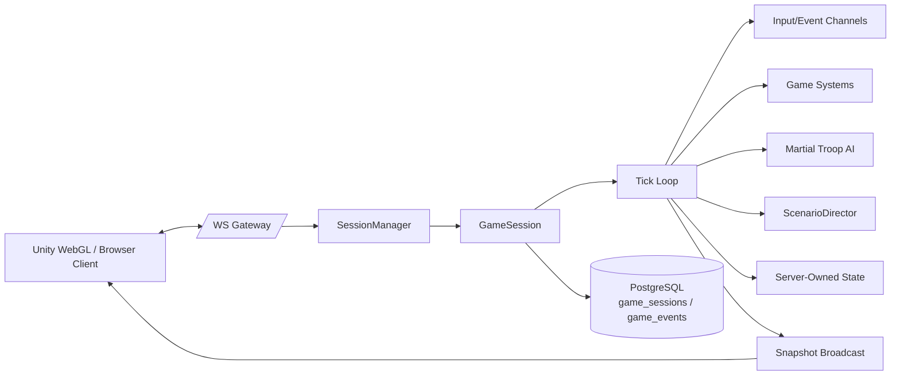

# Mayday — server

`mayday-server` is the authoritative game server for **Mayday**, a single-player web 3D FPS that interprets the May 18 Gwangju Democratization Movement from the perspective of a civilian militia. The opposing forces are martial law troops controlled entirely by server-side AI.

The player **cannot win**. This is a deliberate design constraint, not a bug. Mayday is intended as a historical experience and a backend architecture exercise — not a power fantasy. Server systems express asymmetry, encirclement, resource exhaustion, and inevitable defeat. The work of the server is to model that pressure honestly and respectfully, and to record each session in a form that can be replayed and analyzed.

This repository contains only the server. The Unity WebGL client is developed separately.

---

## Why this exists

Mayday is built as a backend portfolio project. The interesting engineering claims it makes:

- A Go-based **authoritative game server** with no client trust.
- A **session-specific goroutine tick loop** with channel-based input and event queues.
- All state mutation is **serialized inside the session loop**, with WebSocket transport cleanly separated from simulation.
- **Server-side hit validation** (no client-reported hits).
- **FSM-based AI** for martial law troops (`PATROL → CHASE → ATTACK → SUPPRESS → FLANK → BLOCK_EXIT → CALL_REINFORCEMENT → TAKE_COVER → DEAD`).
- A **ScenarioDirector** that owns phase progression and **guarantees eventual defeat**.
- A **PostgreSQL event log** (`game_events`) suitable for replay tooling and analytics.
- **Dockerized** local development.
- Clean package boundaries and **testable domain logic**.

---

## Architecture



The server is the only source of truth.

| Server owns                                                                                              | Client owns                                  |
|----------------------------------------------------------------------------------------------------------|----------------------------------------------|
| player position, rotation, velocity, HP, ammo, troop state, AI decisions, hit validation, scenario phase | rendering, camera, animation, sound, UI      |
| damage, death, defeat, event log, final session result                                                   | local input collection, prediction (future)  |

### Why Go

- A simulation server that needs many isolated tick loops maps cleanly to goroutines and channels.
- `context.Context` propagates cancellation down to the per-session loop, so disconnects and shutdowns terminate cleanly.
- The standard library covers HTTP, JSON, and structured logging (`log/slog`); the only third-party dependencies are `gorilla/websocket`, `pgx`, `google/uuid`, and `testify`.
- Static binaries make the Docker image small and predictable.

### Package boundaries

```
cmd/server/                 # main entry point
internal/config/            # env-backed typed config + validation
internal/logger/            # slog setup
internal/observability/     # uptime / counters
internal/protocol/          # wire types, envelope, parser, encoder
internal/storage/           # pgx pool + EventRepository / SessionRepository (+ no-op + memory fallbacks)
internal/transport/http/    # /health and HTTP server bootstrap
internal/transport/websocket/   # gorilla/websocket gateway + per-connection reader/writer
internal/game/              # Session, SessionManager, tick loop, events, constants
internal/game/state/        # CivilianPlayerState, MartialTroopState (separated to break import cycles)
internal/game/math/         # Vector3, raycast helpers
internal/game/scenario/     # Phase, DefeatReason, PressureInput, Director
internal/game/systems/      # movement, shooting, damage, defeat, objective, respawn helpers
internal/ai/                # FSM states, Action, perception, decision (pure)
internal/ai/behavior/       # per-state behavior helpers
migrations/                 # SQL migrations driven by goose
tests/                      # cross-package tests
```

The session goroutine never holds a mutex while waiting on the network, and the WebSocket goroutine never mutates simulation state. All cross-goroutine communication runs through buffered channels.

---

## Session lifecycle

1. Client opens `WS /ws`.
2. Client sends `start_session`. The server allocates a `Session`, persists a row in `game_sessions`, and starts the tick loop.
3. Each tick (default 30Hz):
   1. Drain queued client inputs (movement, look, shoot, ping…).
   2. Advance the **ScenarioDirector** (phase, pressure, encirclement).
   3. Spawn troops on phase changes if needed.
   4. Run AI **perception → decision → actions** for each troop.
   5. Apply troop shots through the same damage system the player uses.
   6. Accumulate survival time.
   7. Every snapshot interval (default 15Hz), broadcast a `state_snapshot`.
4. Defeat is triggered by death, scripted timing, encirclement, or ammo exhaustion. The session emits `defeat_triggered`, then `session_ended`, persists the final summary, and exits.
5. Disconnects translate into `DefeatReason: DISCONNECTED`.

A single `time.Ticker` drives the loop; a `context.Context` from the parent (HTTP or transport) terminates it.

---

## WebSocket protocol

All frames share an envelope:

```json
{ "type": "<message_type>", "payload": { ... } }
```

### Client → Server (excerpt)

```json
{ "type": "start_session", "payload": { "player_name": "anonymous" } }
{ "type": "player_input",  "payload": { "seq": 12, "move": { "forward": true, "right": true }, "delta_ms": 16 } }
{ "type": "player_look",   "payload": { "yaw": 1.5, "pitch": -0.2 } }
{ "type": "shoot",         "payload": { "seq": 18, "origin": { "x":0,"y":1.6,"z":0 }, "direction": { "x":0,"y":0,"z":1 }, "client_time": 123456 } }
{ "type": "reload",        "payload": {} }
{ "type": "interact",      "payload": { "target_id": "..." } }
{ "type": "ping",          "payload": { "client_time": 123456 } }
```

### Server → Client (types)

`welcome`, `session_started`, `state_snapshot`, `troop_spawned`, `shot_result`, `damage_taken`, `player_died`, `scenario_phase_changed`, `pressure_changed`, `defeat_triggered`, `session_ended`, `event_logged`, `pong`, `error`.

The `state_snapshot` payload is intentionally compact (player + troop summaries + recent event metadata) so it can be broadcast at the snapshot rate without dragging the full event log along with it.

---

## Martial Law Troop AI

The AI is implemented as a finite state machine over per-tick perception. Decision logic is a pure function (`ai.Decide`) so it can be tested in isolation.

```
       ┌────────┐  player visible
PATROL │PATROL  │ ───────────────► CHASE ─► ATTACK ─► SUPPRESS
       └────────┘                    │         │         │
                                     │         ▼         ▼
                                     └─► FLANK / BLOCK_EXIT (ENCIRCLEMENT / FINAL_STAND)
                                          │
                                          ▼
                                    CALL_REINFORCEMENT
                                          │
TAKE_COVER ◄── HP low / pressure low ─────┘
DEAD       ◄── HP ≤ 0
```

Perception is intentionally simple for the MVP: a troop sees the player when the distance is below `TROOP_DETECTION_RANGE`; it can attack inside `TROOP_ATTACK_RANGE`. Future work can add line-of-sight raycasting against a map.

AI emits `Action`s (`MOVE_TO`, `LOOK_AT`, `SHOOT`, `FLANK_TO`, `BLOCK_EXIT`, `CALL_REINFORCEMENT`, `TAKE_COVER`, …). The game systems are responsible for translating those actions into authoritative state mutations — AI never touches the world directly.

---

## ScenarioDirector — inevitable defeat

`scenario.Director` owns:

- `CurrentPhase`: `INITIAL_CONTACT → ESCALATION → REINFORCEMENT → ENCIRCLEMENT → FINAL_STAND → DEFEAT`
- `PressureLevel` ∈ [0, 1] derived from elapsed time, player HP, ammo, and surviving troop count
- `EncirclementLevel` ∈ [0, 1] (quadratic ease-in over time)
- `ReinforcementLevel`, `EscapeBlocked`
- `ForcedDefeatTriggered`, `DefeatReason`

The director runs every tick and:

1. Recomputes pressure and encirclement.
2. Advances the phase based on time and pressure.
3. Checks defeat triggers:
   - `PLAYER_KILLED` if `IsAlive == false`
   - `SCRIPTED_FINAL_STAND` after `FORCE_DEFEAT_AFTER_MS`
   - `AMMO_EXHAUSTED` in `FINAL_STAND` if ammo is zero with troops alive
   - `ENCIRCLED` in `FINAL_STAND` once encirclement nears 1.0
4. Returns an `Update` describing what changed so the session can emit the right events.

There is no `VICTORY` phase. There is no win condition. Sessions end. Outcomes vary in how long the player survived, how many troops they neutralized, what ammo and HP they had left, and which `DefeatReason` was reached.

---

## Shooting validation

Every `shoot` message is treated as a **request** the server may reject:

- player must exist, be alive, and have ammo
- fire rate is enforced (`FIRE_RATE_LIMIT_MS`)
- direction must be non-zero
- the server runs its own raycast against troop positions and only counts hits within `SHOOT_MAX_DISTANCE` and a dot-product cone defined by `SHOOT_ANGLE_THRESHOLD`
- the nearest valid troop along the ray is chosen — never the client's claimed target
- damage is applied server-side; only then is `shot_result` returned

Troop AI shots run through the same damage system as player shots, just with their own damage / fire-rate parameters.

---

## PostgreSQL event log

Two tables (see `migrations/`):

| Table         | Purpose                                                  |
|---------------|----------------------------------------------------------|
| `game_sessions` | Session-level summary: started_at, ended_at, defeat_reason, shots_fired/hit, damage_taken, troops_neutralized, survived_ms |
| `game_events`   | Append-only per-tick events: `SESSION_STARTED`, `PHASE_CHANGED`, `PRESSURE_CHANGED`, `TROOP_SPAWNED`, `PLAYER_SHOT`, `PLAYER_HIT_TROOP`, `PLAYER_DAMAGED`, `PLAYER_DIED`, `DEFEAT_TRIGGERED`, `SESSION_ENDED` |

Each event has a JSONB payload, a `server_tick`, and a foreign key to the session. Indexes on `(session_id, server_tick)` and `type` make replay-style and analytics queries cheap.

The session pushes events into a buffered channel; a separate persister goroutine drains the channel, so a slow database can never stall the tick loop. If the channel is full, the event is dropped from persistence (with a warning) but still observed by clients via `event_logged`.

If the database is unreachable at startup, `mayday-server` boots with no-op repositories rather than crashing — the live game still runs, just without persistence.

---

## Local setup

Requirements: Go ≥ 1.22, optionally `goose` for migrations and a local Postgres.

```bash
cp .env.example .env
make tidy
make build
./bin/mayday-server
# or
make run
```

By default the server listens on `:3001`.

```bash
curl http://localhost:3001/health
# {"status":"ok","service":"mayday-server","uptime":...,"timestamp":"..."}
```

---

## Docker setup

```bash
docker compose up --build
```

This brings up Postgres and `mayday-server` together. The server is exposed on `localhost:3001` and Postgres on `localhost:5432`.

---

## Migrations

```bash
make migrate-up     # apply
make migrate-down   # roll back the most recent
```

`make` looks for `goose` on `PATH`. Install with:

```bash
go install github.com/pressly/goose/v3/cmd/goose@latest
```

You can override the database URL: `make migrate-up DB_URL=postgres://...`.

---

## Tests

```bash
make test
```

Covers:

- `Vector3` / raycast hit / miss / off-angle / out-of-range
- `protocol.Parse` valid + invalid + unknown types + malformed payload
- AI: attack-in-range, chase-out-of-range, flank during encirclement, call reinforcement during reinforcement
- Shooting: dead player, no-ammo, fire-rate, hit, miss, kill
- ScenarioDirector: phase progression, eventual scripted defeat, player-killed defeat, disconnect handling
- Session: tick loop starts and stops cleanly, emits welcome/session_started/session_ended

---

## Manual WebSocket test

A minimal session looks like:

```bash
# any websocket client (websocat, wscat) works
websocat ws://localhost:3001/ws
```

Then send:

```json
{"type":"start_session","payload":{"player_name":"jin"}}
{"type":"player_input","payload":{"seq":1,"move":{"forward":true},"delta_ms":16}}
{"type":"shoot","payload":{"seq":2,"origin":{"x":0,"y":1.6,"z":0},"direction":{"x":0,"y":0,"z":1},"client_time":0}}
{"type":"ping","payload":{"client_time":0}}
```

You should observe `welcome`, `session_started`, `troop_spawned`, periodic `state_snapshot`, eventual `pressure_changed`, `scenario_phase_changed`, and finally `defeat_triggered` followed by `session_ended`.

---

## Current limitations

- Single-player only by design. The `Session` type is single-tenant.
- No map / collision: troops and the player share an open plane, so positions are unconstrained.
- No client-side prediction or reconciliation yet — snapshots are authoritative and clients are expected to interpolate.
- Reload is a placeholder that tops up to max ammo when empty (no timer or reload animation gating).
- Suppression is mostly atmospheric in the MVP — it shapes troop posture but does not yet add per-area accuracy debuffs.
- AI line-of-sight is distance-only; no occlusion.
- No spatial partitioning; for the MVP troop counts (≤ 30) a linear scan is fine.

These are explicit MVP cutoffs, not unknown unknowns.

---

## Roadmap

- Unity WebGL client integration
- Client-side prediction + server reconciliation
- Entity interpolation
- Lag compensation for shots
- Map collision and occluded line-of-sight raycasts
- Spatial partitioning (uniform grid / BVH)
- Replay viewer driven by `game_events`
- Analytics dashboard over `game_events` (phase distributions, defeat reason histograms, average survival per phase)
- More nuanced civilian objectives — rescue, supply caches, sheltering — that produce richer event logs
- Accessibility settings (input remapping, contrast modes, reduced-motion)
- A possible Python AI service split, only if reinforcement-learned bots are introduced later

---

## Backend portfolio notes

If you are reading this as a portfolio reviewer, the parts I most want to call out:

- **Authoritative single-player server.** Single-player is the simplest topology, but the server is still the only source of truth — every shot, every position, every defeat is decided by the server. The codebase intentionally treats the client as untrusted.
- **Concurrency model is conservative.** A session goroutine owns its state. Inputs come in over a buffered channel. Outbound messages go out over another buffered channel. Mutexes appear only where two goroutines genuinely cross — `SessionManager`'s session map and the `Client`'s send buffer guards. Everything else is single-goroutine code, which makes the simulation easy to reason about.
- **Graceful degradation.** If Postgres is offline, the server boots with no-op repositories and keeps simulating; events still flow to the client. If the event persister falls behind, events are dropped from persistence rather than blocking the tick loop.
- **Pure decision logic.** AI decisions and pressure computations are pure functions over their inputs (no globals, no side effects), which makes them straightforward to unit test.
- **Historical respect, encoded in types.** The naming throughout (`CivilianPlayerState`, `MartialTroopState`, `troops_neutralized`, `DefeatReason`) deliberately avoids the language of arcade shooters. The lack of a `VICTORY` state is enforced at the type level — there is no enum value for it to take.

The point of the project is not to make a fun game. It is to model an asymmetry truthfully, with the simplest server architecture that can do that job, and to keep that architecture small enough to reason about end-to-end.
